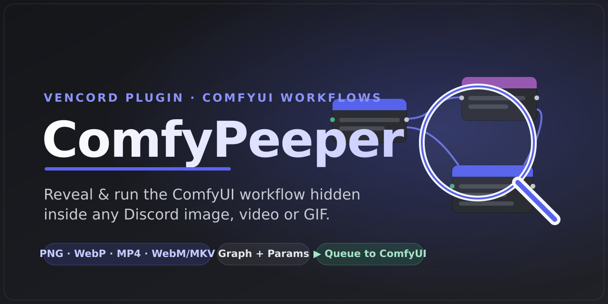
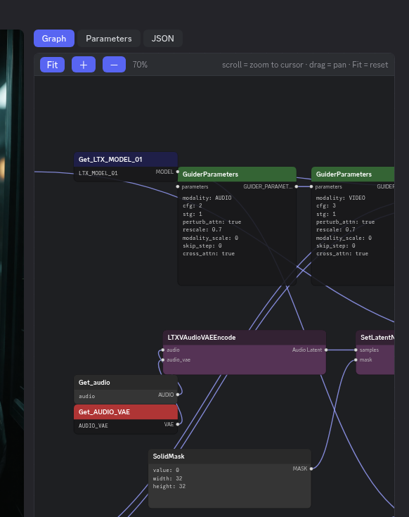
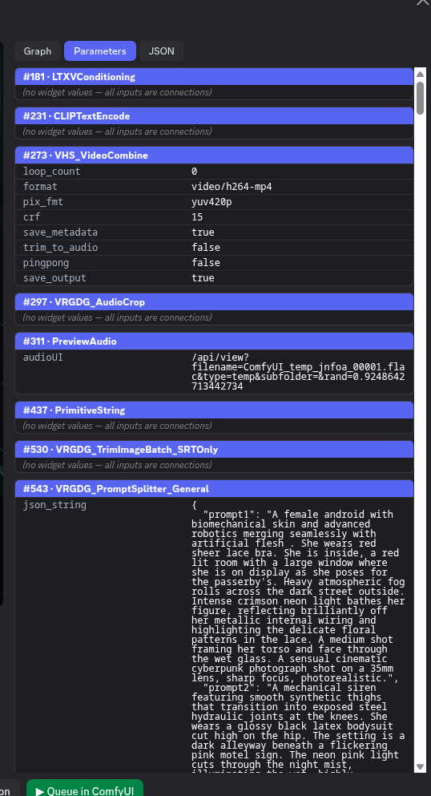

<div align="center">



# Discord-ComfyPeeper

**Reveal & run the ComfyUI workflow hidden inside any Discord image, video, or animation.**

A [Vencord](https://vencord.dev) user-plugin that detects ComfyUI metadata embedded in Discord
attachments, badges them, and lets you inspect the node graph, copy/save the JSON, or queue the
workflow straight to a ComfyUI instance — local *or* remote.

[](LICENSE)


</div>

---

## ✨ Features

- **Auto-detect** ComfyUI workflows embedded in **PNG, WebP, MP4/MOV, and WebM/MKV** attachments, posted directly as a **`.json`** file, or even **pasted as raw JSON / a code block** in a message — with a node-graph badge on the media (or below the message).
- 🧩 **Multiple workflows per file** — a video often carries a whole chain (e.g. a generation graph *and* a post-processing graph). ComfyPeeper extracts **all** of them and gives you a selector to switch between them in the previewer.
- 🔬 **Interactive graph preview** — a faithful node-graph render (pan, zoom-to-cursor, fit) showing each node's title, connections, and widget values.
- 📋 **Parameters view** — every node's settings as a clean, copyable list (seed, steps, cfg, sampler, prompts, LoRAs…).
- 🧾 **Raw JSON** — both the editor `workflow` and the API `prompt` graphs, selectable and copyable.
- 💾 **Copy / Save** the workflow or prompt as `.json`.
- ▶️ **Queue to ComfyUI** — POST the workflow to a running instance, with **one button per configured server** (local and/or remote).
- ✅ **Server compatibility check** — see which of your servers can actually run a workflow, and which **custom nodes are missing** — highlighted **in red on the graph**, just like ComfyUI.
- 🛰️ **Companion (optional)** — install the small **[ComfyUI companion extension](comfyui-companion/)** to **Send to ComfyUI** (load a workflow straight into your live editor tab, not just queue it headless) and **Send to Discord** (right-click an output image in ComfyUI → posts it to a webhook). The plugin auto-detects companion-enabled servers and labels them by name (advanced mode).
- 🎚️ **Advanced mode (opt-in)** — adds a **LoRAs** tab that lists every LoRA a workflow uses and checks them against your ComfyUI server(s) (via `/object_info`, no extra setup). Missing ones get **Civitai / Civitai.red / CivArchive / Hugging Face search links**, and — when **[ComfyUI-Lora-Manager](https://github.com/willmiao/ComfyUI-Lora-Manager)** is reachable (built into ComfyUI *or* a standalone instance) — a one-click **download** straight into the right models folder (with CivArchive fallback for removed models). Off by default.
- 📎 **Upload sidecar** — Discord strips metadata from re-encoded videos. When you upload a workflow-bearing video, ComfyPeeper offers to attach the workflow(s) as `.json` sidecar(s) so they **survive for everyone** — and re-pairs them with the video on the receiving end (the whole chain, not just one).
- 📚 **Local library** — **★ Save** any workflow to an offline library (stored in-plugin via IndexedDB) with a thumbnail and a jump-link back to the post. Keeps your workflows **even if the original message is deleted**. A **date timeline split by the channel** each workflow came from, plus a **search** that matches the filename, the channel, *and* the workflow's own metadata (model names, node types, prompts…). Open it from the **Vencord Toolbox**, the plugin settings, or the **Library** button in the previewer.
- 🔗 **Associate media by hand** — when the media and its workflow are posted **separately**, right-click the image/video → **Associate with workflow** to attach it to a saved entry as the preview (pick from the last 3 saved or search the library). Only a small downscaled frame is stored — never the full file.
- 🌐 **Desktop *and* browser** — runs in Vesktop/Discord-desktop (native) and on Discord in a web browser via a Tampermonkey userscript (see Install).

## 📸 Screenshots

<div align="center">

&nbsp;&nbsp;

</div>

## 🧠 How it works

ComfyUI saves two graphs in the files it exports:

| graph      | what it is            | used for                                    |
|------------|-----------------------|---------------------------------------------|
| `workflow` | the node-editor graph | the **Graph** preview, Copy / Save          |
| `prompt`   | the API-format graph  | **Queue** (`POST /prompt`), **Parameters**  |

…stored differently per container:

| format     | where the metadata lives                                   |
|------------|------------------------------------------------------------|
| PNG        | `tEXt` / `zTXt` / `iTXt` text chunks                        |
| WebP       | EXIF (`Make` = workflow, `Model` = prompt)                  |
| MP4 / MOV  | the `moov` atom (libav container metadata)                  |
| WebM / MKV | Matroska `Tags` (EBML) — scanned at the file's head & tail  |
| `.json`    | the file itself — an exported `workflow` or API `prompt` graph |

On desktop, all fetching and parsing happens in Vencord's **native (main) process**, so there are
no CORS or mixed-content restrictions — that's why plain-`http` local endpoints work. In a browser
there's no main process, so a **renderer fallback** does the same work with `fetch`; under a
Tampermonkey userscript Vencord routes that through `GM_xmlhttpRequest`, which likewise bypasses
CORS + mixed-content (so even a remote `http` ComfyUI can be queued). For videos it fetches only the
metadata region via HTTP **Range** requests, never the whole file. It always reads the **original**
`cdn.discordapp.com` attachment, never the re-encoded `media.discordapp.net` proxy (which strips
metadata).

## 🚀 Install

> Custom plugins require a **Vencord built from source** — the official installer build can't load
> user-plugins. Vesktop users: see the **[full install guide → docs/INSTALL.md](docs/INSTALL.md)**
> (Vesktop ignores the custom-Vencord setting and needs an extra step).

**Quick version (a from-source Vencord):**

```bash
git clone https://github.com/ethanfel/Discord-ComfyPeeper
cp -r Discord-ComfyPeeper/comfyPeeper <Vencord>/src/userplugins/
cd <Vencord> && pnpm build && pnpm inject   # inject only if not already injected
# restart Discord → Settings → Plugins → enable "ComfyPeeper"
```

There's a helper for Vesktop/Vencord that builds and deploys in one step:

```bash
VENCORD_DIR=~/Vencord ./scripts/install-vesktop.sh
```

**Browser (Discord on the web):** ComfyPeeper also runs as a Vencord **Tampermonkey userscript**.
A renderer fallback handles all parsing without the native module, and the userscript's
`GM_xmlhttpRequest` bypasses CORS + mixed-content — so detection/preview/library *and* ComfyUI
queueing (even a remote `http://` instance) work in the browser. Tampermonkey only.

```bash
VENCORD_DIR=~/Vencord ./scripts/build-userscript.sh   # → dist/Vencord.user.js, import in Tampermonkey
```

See **[docs/INSTALL.md → Browser](docs/INSTALL.md#browser-tampermonkey-userscript)** for details.

## ⚙️ Settings

| setting      | description |
|--------------|-------------|
| **Open saved workflows library** | Button that opens the local library (also on the Vencord Toolbox and in the previewer). |
| **advancedMode** | Adds a **LoRAs** tab to the previewer: checks a workflow's LoRAs against your server(s) and helps download missing ones (via ComfyUI-Lora-Manager when reachable, plus Civitai / Civitai.red / CivArchive / Hugging Face search links). Off by default. |
| **loraManagerUrl** | Address of a **standalone** ComfyUI-Lora-Manager (e.g. `http://192.168.1.50:8188`). Set this only if LoRA Manager runs separately from ComfyUI; blank = auto-detected on each ComfyUI server. Advanced mode only. |
| **attachWorkflowOnUpload** | When you upload a video with an embedded workflow, attach it as a `.json` sidecar so it survives Discord's metadata stripping (default on). |
| **attachMode** | `Ask each time` (default) or `Attach automatically (no prompt)`. |
| **endpoints** | Comma-separated ComfyUI servers, optionally labelled: `Local = http://127.0.0.1:8188, Remote = https://gpu.example.com:8188`. A `Queue → <label>` button appears per server. |
| **badgeMode** | `Overlay on the image` (default, falls back to below-message), `Below the message`, or `Both`. |
| **autoScan**  | Auto-scan attachments (default on). Off → a small "Check workflow" button instead (saves bandwidth). |
| **maxSizeMB** | Skip files larger than this when scanning (default 40 MB; videos read only the metadata region). |

## 🧭 Usage

1. Drop (or scroll to) a ComfyUI image/video in any channel → a **ComfyUI workflow** badge appears on it.
2. Click it to open the previewer: **Graph**, **Parameters**, and **JSON** tabs.
3. **Copy / Save** the workflow, or **Queue → \<server\>** to run it.
4. Not sure a server has the right nodes? Hit **Check servers** — green = can run, red = missing nodes (click a red server to highlight the missing nodes on the graph).

## ⚠️ Limitations

- ComfyUI's `/prompt` rejects a workflow if the target server is **missing a custom node** — that
  can't be worked around, only surfaced (use **Check servers**). Install the missing nodes
  (e.g. via ComfyUI-Manager) or pick a server that has them.
- **Queue** runs the API graph headless on the server; it doesn't open the workflow in an editor
  tab (use **Copy/Save** for that). Workflows referencing input images won't auto-upload them.
- In-modal **video playback** for `.mkv` may not work in Chromium, but metadata extraction does.
- Discord strips metadata from re-compressed media; only original-quality attachments are detected.
- Client mods are against Discord's ToS — for personal use.

## 🛠️ Development

The plugin is a standard Vencord user-plugin (`comfyPeeper/`):

| file | role |
|------|------|
| `index.tsx`         | plugin definition, badge + overlay, message accessory, sidecar pairing |
| `native.ts`         | main-process (desktop): fetch + PNG/WebP/MP4/MKV parsing, queue, compat check |
| `webFallback.ts`    | renderer fallback (browser/userscript): same surface via `fetch` + typed arrays |
| `uploadHook.tsx`    | attach workflow `.json` sidecar(s) when uploading a workflow-bearing video |
| `WorkflowModal.tsx` | the previewer modal (Graph / Parameters / JSON / variant selector / actions) |
| `WorkflowGraph.tsx` | the interactive SVG node-graph renderer |
| `library.ts` · `LibraryModal.tsx` | the offline library (IndexedDB) and its timeline/search UI |
| `icons.tsx` · `settings.tsx` · `utils.ts` · `styles.css` | node icon, settings, shared helpers, styles |

Build with the standard Vencord toolchain — `pnpm build` (desktop) or `pnpm buildWeb` (browser/userscript).

## 📄 License

[GPL-3.0-or-later](LICENSE) — same as Vencord.

Not affiliated with Discord, Vencord, or ComfyUI.
